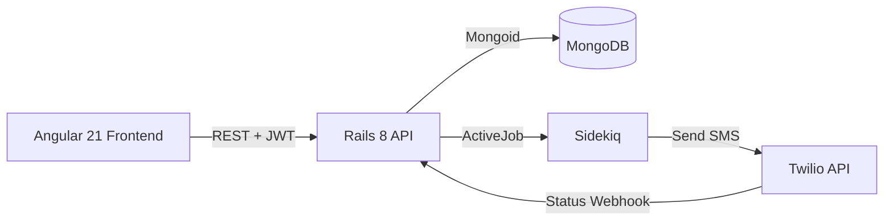

# MySMS Messenger

Full-stack web app for sending and viewing SMS messages. Built with Angular (frontend), Ruby on Rails (API), MongoDB, and Twilio.

## Architecture



- **Frontend:** Angular 21, standalone components, Signals, Vitest
- **Backend:** Rails 8 API, Mongoid (MongoDB), Puma
- **Auth:** JWT (bcrypt + jti revocation)
- **SMS:** Twilio, sent asynchronously via Sidekiq
- **Delivery status:** Twilio webhooks update message status (queued → sent → delivered/failed)

## Requirements

- Ruby 3.4+
- Node.js 20+
- MongoDB 7+
- Redis (for Sidekiq)
- Twilio account (free tier is enough)

## Quick start (local)

### Backend

```bash
cd backend
cp .env.example .env   # Edit with your Twilio and JWT secret
bundle install
rails server -p 3000
```

In another terminal, start Sidekiq (and ensure Redis is running):

```bash
cd backend
bundle exec sidekiq
```

### Frontend

```bash
cd frontend
npm install
npm start   # Serves with proxy to backend at http://localhost:4200
```

Open http://localhost:4200. Sign up or log in, then send an SMS (use Twilio’s trial number as recipient when on a free account).

## Docker

```bash
cp backend/.env.example backend/.env   # Add Twilio and JWT keys
docker compose up --build
```

App: http://localhost (Nginx). API: http://localhost/api.

## Environment variables

| Variable | Description |
|----------|-------------|
| `MONGODB_URI` | MongoDB connection string |
| `REDIS_URL` | Redis URL for Sidekiq |
| `TWILIO_ACCOUNT_SID` | Twilio account SID |
| `TWILIO_AUTH_TOKEN` | Twilio auth token |
| `TWILIO_PHONE_NUMBER` | Twilio sender number (e.g. +1234567890) |
| `TWILIO_WEBHOOK_BASE_URL` | Public base URL for status callbacks (e.g. https://yourdomain.com) |
| `JWT_SECRET_KEY` | Secret for signing JWTs (min 32 chars in production) |
| `CORS_ORIGINS` | Allowed frontend origins (e.g. http://localhost:4200) |

## API

Base path: `/api/v1`. All JSON; errors: `{ "error": { "code", "message", "details" } }`.

### Auth

| Method | Path | Description |
|--------|------|-------------|
| POST | `/api/v1/signup` | Body: `{ "user": { "email", "password", "password_confirmation" } }`. Returns `{ "data": { "token", "user" } }`. |
| POST | `/api/v1/login` | Body: `{ "email", "password" }`. Returns `{ "data": { "token", "user" } }`. |
| DELETE | `/api/v1/logout` | Header: `Authorization: Bearer <token>`. Revokes token. |
| GET | `/api/v1/me` | Header: `Authorization: Bearer <token>`. Returns current user or null. |

### Messages

| Method | Path | Description |
|--------|------|-------------|
| GET | `/api/v1/messages` | Query: `page`, `per_page`. Auth: Bearer token or session. Returns paginated list for current user/session. |
| POST | `/api/v1/messages` | Body: `{ "message": { "phone_number", "body" } }`. Creates message and enqueues send. Returns `{ "data": message }`. |

### Other

| Method | Path | Description |
|--------|------|-------------|
| GET | `/health` | Health check (MongoDB connectivity). |

## Tests

- **Backend:** `cd backend && bundle exec rspec`
- **Frontend:** `cd frontend && npm run test -- --no-watch`

CI runs both on push/PR (see `.github/workflows/ci.yml`).

## License

MIT.
